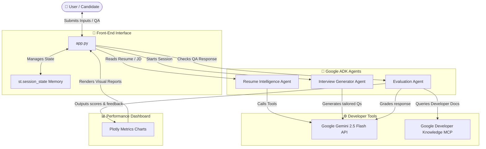

# 🎯 InterviewIQ AI

[](https://www.python.org/)
[](https://streamlit.io/)
[](https://ai.google.dev/)
[](https://modelcontextprotocol.io/)
[](https://pytest.org/)

An agentic, AI-powered mock technical interview and candidate evaluation system. Leveraging **Google Gemini 2.5 Flash**, the **Google Agent Development Kit (ADK)**, and the **Google Developer Knowledge MCP**, InterviewIQ AI conducts realistic mock interviews, evaluates answer accuracy dynamically, retrieves official documentation context on-the-fly, and generates specialized study guides to help candidates level up.

---

## 🏗️ Architecture

Below is the system architecture diagram illustrating the interaction between the candidate, the front-end interface, and the agentic pipeline backed by Gemini and Developer Knowledge MCP:



---

## ✨ Features

- **Resume Analysis**: Automatically extracts technical and soft skills, past experience, and educational background from resumes.
- **Resume Match Score**: Calculates a numeric match percentage comparing candidate skill sets against job requirements.
- **AI Interview Generator**: Dynamically formulates exactly 5 mock interview questions mixing technical, behavioral, and situational concepts tailored to match candidate profile gaps.
- **AI Evaluation**: Evaluates answers instantly to compute ratings, identify strengths/weaknesses, and provide actionable tips.
- **MCP Documentation Retrieval**: Automatically queries the Google Developer Knowledge MCP server to fetch official documentation context for candidate reference.
- **Progress Dashboard**: Compiles analytics, average scores, pass streaks, and custom interactive Plotly trends.

---

## 🛠️ Technologies Used

- **Python**: Core scripting runtime
- **Streamlit**: Web client layout framework
- **Google ADK (Agent Development Kit)**: Orchestrates specialized agents
- **Gemini 2.5 Flash**: Generative AI core intelligence model
- **MCP (Model Context Protocol)**: Exposes search tool context
- **Plotly**: Renders progress charts and graphs
- **Pytest**: Automated testing framework

---

## 📂 Project Structure

```
interviewiq-ai/
├── agents/
│   ├── __init__.py         # Package entry point
│   ├── parser.py           # Resume Intelligence Agent
│   ├── interviewer.py      # Interview Generator Agent
│   └── evaluator.py        # Evaluation Agent
├── tools/
│   ├── __init__.py         # Tools entry point
│   └── agent_tools.py      # Gemini API wrappers & MCP search hooks
├── utils/
│   ├── __init__.py         # Utils entry point
│   └── session_manager.py  # Session state helpers
├── tests/
│   ├── __init__.py         # Test configuration
│   └── test_agents.py      # Pytest unit testing suite
├── app.py                  # Streamlit App UI routing
├── requirements.txt        # Python dependency manifest
├── README.md               # Documentation guide
├── .gitignore              # Ignored file profiles
├── .env.example            # Environment variables template
```

---

## 🚀 Installation & Setup

1. **Clone the Repository**:
   ```bash
   git clone <repository-url>
   cd interviewiq-ai
   ```

2. **Configure Virtual Environment**:
   ```bash
   python -m venv .venv
   
   # Windows:
   .venv\Scripts\activate
   # macOS / Linux:
   source .venv/bin/activate
   ```

3. **Install Dependencies**:
   ```bash
   pip install -r requirements.txt
   ```

4. **Environment Variables**:
   Copy `.env.example` to create `.env`:
   ```bash
   cp .env.example .env
   ```
   Open the `.env` file and set your API keys:
   ```text
   # Core Google API Key for Gemini Access
   GOOGLE_API_KEY="your_actual_gemini_api_key_here"
   
   # Google Developer Knowledge MCP Connection parameters
   DEVELOPER_KNOWLEDGE_API_KEY="your_optional_developer_key"
   ```

---

## 💻 Running the App

To run the Streamlit frontend client locally:
```bash
streamlit run app.py
```

---

## 🧪 Running Tests

To run the mock-driven automated tests verifying agent logic, session state, and MCP offline behaviors:
```bash
pytest
```

---

## 🔮 Future Improvements

- **Voice-Enabled Mocking**: Integrate text-to-speech (TTS) and speech-to-text (STT) for auditory interview experiences.
- **Secure Authentication**: User authentication to save and track user records across multiple sessions.
- **Relational Database Integrations**: Transition from Streamlit session memory to a persistent PostgreSQL/Firestore schema.
- **Advanced Mock Categories**: Support niche interview profiles (e.g., System Design, Product Management, Live Code Sandbox coding challenges).
